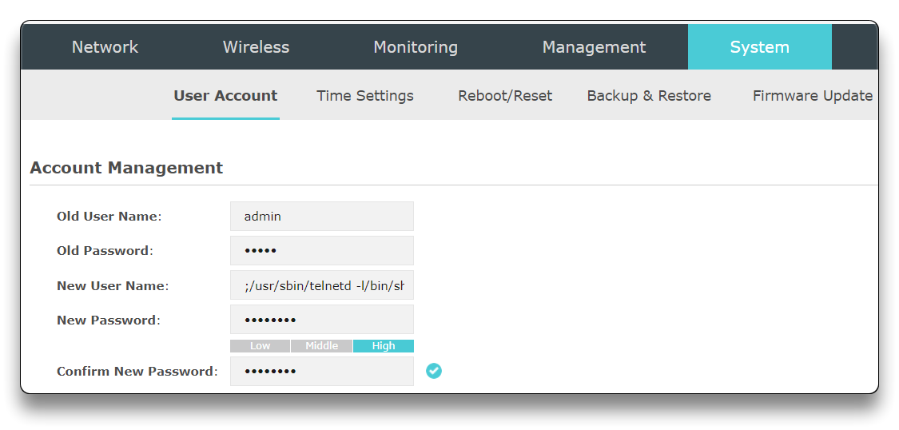
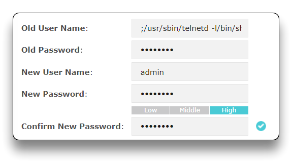
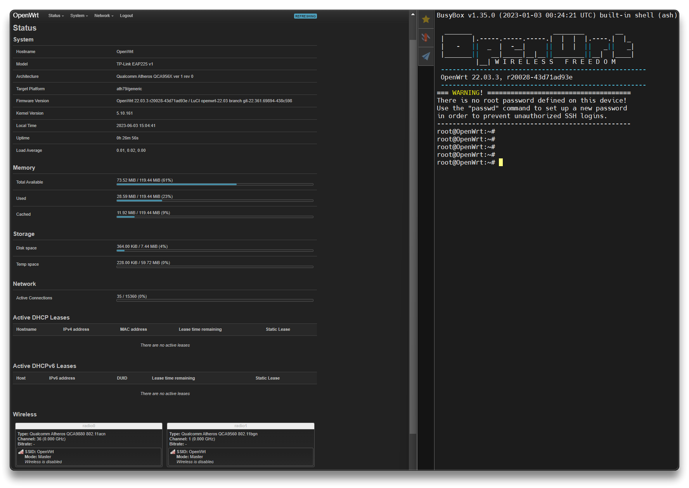
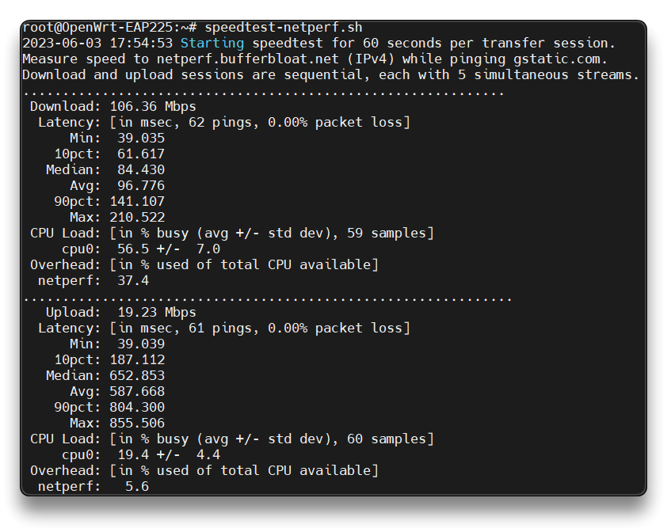
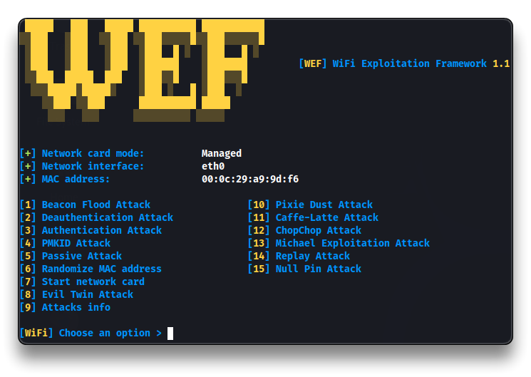

# OpenWrt & WiFi Exploitation


> 🔬 **Hardware Used**
>
> - `TP-Link EAP225 v2`
>
> 🔗 **Useful links**
>
> - [TP-Link EAP225 series - openwrt](https://openwrt.org/toh/tp-link/eap225)
>   - Installation & Switching back to vendor firmware
>
> - [EAP225 v1 firmware - forum](https://forum.openwrt.org/t/eap225-v1-firmware/87116)
> - [Git commit support for TP-Link EAP225 v1](https://git.openwrt.org/?p=openwrt/openwrt.git;a=commit;h=0f6b6aab2bc9d34b5d516ddf38fb14e8c5d029db)
>
>  🔗 **OpenWrt**
>
> - [OpenWrt Source Repository](https://git.openwrt.org/openwrt/openwrt.git)
>   - [https://github.com/openwrt](https://github.com/openwrt)
> - [https://openwrt.org/](https://openwrt.org/)
> - [OpenWrt Packages](https://github.com/openwrt/packages)

| Brand       | Model      | Version | Current Release | OEM Info                                                     | Forum Topic                                                  | Technical Data                                               |
| :---------- | :--------- | :------ | :-------------- | :----------------------------------------------------------- | :----------------------------------------------------------- | :----------------------------------------------------------- |
| **TP-Link** | **EAP225** | **v2**  | 22.03.3         | [https://www.tp-link.com/au/support/download/eap225/v2/](https://www.tp-link.com/au/support/download/eap225/v2/) | [https://forum.openwrt.org/t/anyone-working-on-tp-link-eap225/33956](https://forum.openwrt.org/t/anyone-working-on-tp-link-eap225/33956) | [View/Edit data](https://openwrt.org/toh/hwdata/tp-link/tp-link_eap225_v2) |

| Model  | Version | SoC                      | CPU MHz | Flash MB | RAM MB | WLAN Hardware                                      | WLAN2.4 | WLAN5.0 |
| :----- | :------ | :----------------------- | :------ | :------- | :----- | :------------------------------------------------- | :------ | :------ |
| EAP225 | v2      | Qualcomm Atheros QCA9563 | 775     | 16       | 128    | Qualcomm Atheros QCA9563, Qualcomm Atheros QCA9882 | b/g/n   | a/n/ac  |

## OpenWrt Install

- **Firmware Download**

| Model  | Version | OpenWrt Release | OpenWrt Factory Firmware                                     | OpenWrt Sysupgrade Firmware                                  | OEM Stock Firmware                                           |
| :----- | :------ | :-------------- | :----------------------------------------------------------- | :----------------------------------------------------------- | :----------------------------------------------------------- |
| EAP225 | v2      | 22.03.3         | [https://downloads.openwrt.org/releases/22.03.3/targets/ath79/generic/openwrt-22.03.3-ath79-generic-tplink_eap225-v1-squashfs-factory.bin](https://downloads.openwrt.org/releases/22.03.3/targets/ath79/generic/openwrt-22.03.3-ath79-generic-tplink_eap225-v1-squashfs-factory.bin) | [https://downloads.openwrt.org/releases/22.03.3/targets/ath79/generic/openwrt-22.03.3-ath79-generic-tplink_eap225-v1-squashfs-sysupgrade.bin](https://downloads.openwrt.org/releases/22.03.3/targets/ath79/generic/openwrt-22.03.3-ath79-generic-tplink_eap225-v1-squashfs-sysupgrade.bin) | [https://www.tp-link.com/au/support/download/eap225/v2/#Firmware](https://www.tp-link.com/au/support/download/eap225/v2/#Firmware) |

### [EAP225 v1/v2](https://openwrt.org/toh/tp-link/eap225#eap225_v1v2)

> 📝 **Notes:**
>
> - SSH client must support RSA keys ⇐1024 bits in length. See workaround below.
> - v2 uses same factory image as v1
>
> - [`MobaXTerm`](https://mobaxterm.mobatek.net/download.html) is ok.
>
> - `<DEVICE-IP>` = EAP225 Lan IP
>

1. Upgrade the firmware to version [**v1.4.0**](https://www.tp-link.com/au/support/download/eap225/v2/#Firmware) (that's a strict requirement for the patch to work!)

2. Enable SSH access if you haven't already done so

3. **Exploit** a command injection vulnerability in the user management page of the web interface to start *telnetd* by changing the username to
- `;/usr/sbin/telnetd -l/bin/sh&`



4. Immediately change the malformed username back to something valid (e.g. 'admin') to make ssh work again.



5. Use telnet to connect to your router (`telnet ${device-ip}`) and issue `chmod 777 /tmp` to make it writable

   - ```bash
     telnet <DEVICE-IP>
     
     chmod 777 /tmp
     ```


6. Extract **/usr/bin/uclited** from the device via ssh: 

   - ```bash
     ssh -oPubkeyAcceptedAlgorithms=+ssh-rsa -oHostKeyAlgorithms=ssh-rsa -oKexAlgorithms=+diffie-hellman-group1-sha1 admin@<DEVICE-IP> "dd if=/usr/bin/uclited" > uclited
     ```


7. Create a copy of the file so that the patch can be applied later:

   - ```bash
     cp uclited uclited-patched
     ```

8. Check if the md5sum matches **4bd74183c23859c897ed77e8566b84de**: 

   - ```bash
     md5sum uclited
     ```


9. Apply the binary patch to uclited:

   - ```bash
     echo "000d2354: 24020000 00000000" | xxd -r - uclited-patched
     ```

10. Check if the md5sum matches **4107104024a2e0aeaf6395ed30adccae**:

    - ```bash
      md5sum uclited-patched
      ```


11. Copy the patched uclited binary back to the device at **/tmp/uclited**: 

    - ```bash
      ssh -oPubkeyAcceptedAlgorithms=+ssh-rsa -o HostKeyAlgorithms=ssh-rsa -oKexAlgorithms=+diffie-hellman-group1-sha1 admin@<DEVICE-IP> "dd of=/tmp/uclited" < uclited-patched
      ```

12. Upload the factory image to **/tmp/upgrade.bin**:

    - Copy `openwrt-22.03.3-ath79-generic-tplink_eap225-v1-squashfs-factory.bin` to `%USERPROFILE%\Documents\MobaXterm\home`

    - ```bash
      ssh -oPubkeyAcceptedAlgorithms=+ssh-rsa -o HostKeyAlgorithms=ssh-rsa -oKexAlgorithms=+diffie-hellman-group1-sha1 admin@<DEVICE-IP> "dd of=/tmp/upgrade.bin" < openwrt-22.03.3-ath79-generic-tplink_eap225-v1-squashfs-factory.bin
      ```


13. Finally, install OpenWrt (via the telnet session): `chmod +x /tmp/uclited && /tmp/uclited -u`

    - ```bash
      chmod +x /tmp/uclited && /tmp/uclited -u
      ```


✅ Success! - **`OpenWrt 22.03.3`**



- New Default IP: `192.168.1.1`.
- SSH into it and set a static IP from the LAN network + Gateway + DNS.

```bash
ssh root@192.168.1.1

# Set Static IP for the LAN
uci set network.lan.ipaddr="192.168.7.225"
uci set network.lan.gateway="192.168.7.254"
uci set network.lan.dns="1.1.1.1"
uci commit
/etc/init.d/network restart

ssh root@192.168.7.225
opkg update
```

> #### Workaround for SSH key length (NOT USED with MobaXTerm)
>
> The SSH server (dropbear) on the factory image uses weak crypto algorithms and short key length. Openssh clients distributed with most modern Linux distributions do not support this by default. Here are some options to workaround this:
>
> 1. Use alternative SSH client: `openssh-client-ssh1` package
> 2. Update the host key length:
>    1. telnet to the router
>    2. run command `/usr/local/sbin/dropbearkey -t rsa -f /tmp/dropbear_rsa_host_key2 -s 2048`
>    3. kill currently running dropbear process
>    4. run command `/usr/local/sbin/dropbear -p 22 -r /tmp/dropbear_rsa_host_key2 -d /tmp/dropbear_dss_host_key -L`
>    5. now you should be able to SSH using the ssh commands supplied

## OpenWrt Docs

> 🔗 **Links**
>
> - [User guide](https://openwrt.org/docs/guide-user/start)
> - [Quick start guide for OpenWrt installation](https://openwrt.org/docs/guide-quick-start/start)

### [Upgrading OpenWrt fw - CLI](https://openwrt.org/docs/guide-user/installation/sysupgrade.cli)

> 📌 **For experienced users only!**
>
> - This HOWTO will upgrade an existing OpenWrt firmware to a new version from the SSH command line.
> - A lot of information in this wiki page duplicates content of [generic OpenWrt OS upgrade procedure](https://openwrt.org/docs/guide-user/installation/generic.sysupgrade).
> - Non-experienced users are strongly advised to [Upgrading OpenWrt firmware using LuCI](https://openwrt.org/docs/guide-quick-start/sysupgrade.luci) instead.
> - If you need some configuration options changed for the first boot, for example you need Wi-Fi enabled after flashing, follow [this guide](https://openwrt.org/docs/guide-user/installation/flashing_openwrt_with_wifi_enabled_on_first_boot).
>
> ## Back up OpenWrt configuration
>
> Follow [Backup and restore](https://openwrt.org/docs/guide-user/troubleshooting/backup_restore), or skip this section if you do not want to preserve existing configuration.
>
> ## Download and verify the OpenWrt firmware upgrade image
>
> Download and use only OpenWrt firmware images ending in **“-sysupgrade.bin”** for command line upgrades.
> For x86 systems there is no “sysupgrade” image, just be sure the new firmware image has the same family of filesystem as your old one.
>
> 📌 Note: upgrade files must be placed in /tmp, as the sysupgrade procedure unmounts flash storage during the upgrade process. If the upgrade file is not in **/tmp**, sysupgrade will NOT perform any upgrade and only reboot the system.
>
> Download the desired upgrade file to your OpenWrt's `/tmp` directory and [verify firmware checksum](https://openwrt.org/docs/guide-quick-start/verify_firmware_checksum). `/tmp` directory is stored in the device RAM:
>
> 1. Check free memory is available: Run `free`. Proceed, if “free Mem” is the size of your firmware file + some extra mem (at least twice the size of your firmware file is perfect).
>
> 2. Set the following variables to the download address of your OpenWrt firmware file (you must customize the URL!). You'll find a link to the file “sha256sums” in the Supplementary Files section of the download page for the architecture of your router, beneath the Image Files section:
>
> 3. ```
>    DOWNLOAD_LINK="http://URLOFFIRMWAREBIN"; SHA256SUMS="http://URLOFSHA256"
>    ```
>
> 4. Download and check the firmware checksum with:
>
>    ```
>    cd /tmp;wget $DOWNLOAD_LINK;wget $SHA256SUMS;sha256sum -c sha256sums 2>/dev/null|grep OK
>    ```
>
> 5. In the screen output, look for the correct checksum verification:
>
>    ```
>    FILE_NAME: OK
>    ```
>
> 6. Do not continue, if the checksum verification mismatches!
>
> **Troubleshooting:**
>
> - If you **cant use 'wget'** (e.g. because you want to transfer firmware from your PC to your OpenWrt device)
>   - you can use **scp**: `scp openwrt-ar71xx-tl-wr1043nd-v1-squashfs-sysupgrade.bin root@192.168.1.1:/tmp` (Ensure you have set a non-null password for your device root account to properly use scp.)
>   - you can use **ssh**: `ssh root@192.168.1.1 “cat > /tmp/openwrt-ar71xx-tl-wr1043nd-v1-squashfs-sysupgrade.bin” < openwrt-ar71xx-tl-wr1043nd-v1-squashfs-sysupgrade.bin` (Also ensure you have set a non-null password for your device root account.)
>   - you can also use **nc/netcat**:
>     1. On your Linux PC run: `cat [specified firmware].bin | pv -b | nc -l -p 3333`
>     2. On your OpenWrt device run (Assuming 192.168.1.111 is the IP of your Linux PC): `nc 192.168.1.111 3333 > /tmp/[specified firmware].bin`
> - If the **checksum mismatches**: Redo the firmware download, if the mismatch remains, ask for help in the ["Installing and Using OpenWrt" Forum](https://forum.openwrt.org/c/installation)
> - If **low on RAM** see: **[CLI - Low Memory Workarounds](https://openwrt.org/docs/guide-user/installation/sysupgrade.cli#low_memory_workaroundstmp_is_too_small_to_hold_the_downloaded_file)**
>
> ### Command-line instructions
>
> OpenWrt provides [sysupgrade](https://openwrt.org/docs/techref/sysupgrade) utility for firmware upgrade procedure.
>
> [Verify](https://openwrt.org/docs/guide-quick-start/verify_firmware_checksum) firmware image checksum. Verify the router has enough free RAM. Upload the firmware from local PC. Flash the firmware.
>
> ```
> # Check the free RAM 
> free
>  
> # Upload firmware
> scp firmware_image.bin root@openwrt.lan:/tmp
>  
> # Flash firmware
> sysupgrade -v /tmp/firmware_image.bin
> ```
>
> **Troubleshooting:**
>
> - If you get the error `ash: /usr/libexec/sftp-server: not found` for the scp command, you are using an OpenSSH Release >= 9 which defaults to using sftp which is not installed by default on OpenWRT. To fallback to the legacy scp/rcp, use the -O flag: `scp -O firmware_image.bin root@openwrt.lan:/tmp`.
>
> #### If sysupgrade is not available.
>
> ```
> # Flash firmware
> mtd -r write /tmp/firmware_image.bin firmware
> ```
>
> - The sysupgrade verbose-option should give some output similar to this. The list of configuration files saved will change depending on what packages you have installed and which files you have configured to be saved, as per above.
>
> ```
> Saving config files...
> etc/config/dhcp
> etc/config/dropbear
> etc/config/firewall
> etc/config/luci
> etc/config/network
> etc/config/snmpd
> etc/config/system
> etc/config/ubootenv
> etc/config/ucitrack
> etc/config/uhttpd
> etc/config/wireless
> etc/dropbear/authorized_keys
> etc/dropbear/dropbear_dss_host_key
> etc/dropbear/dropbear_rsa_host_key
> etc/firewall.user
> etc/group
> etc/hosts
> etc/inittab
> etc/passwd
> etc/profile
> etc/rc.local
> etc/shadow
> etc/shells
> etc/sudoers
> etc/sudoers.d/custom
> etc/sysctl.conf
> etc/sysupgrade.conf
> killall: watchdog: no process killed
> Sending TERM to remaining processes ... ubusd askfirst logd logread netifd odhcpd snmpd uhttpd ntpd dnsmasq
> Sending KILL to remaining processes ... askfirst
> Switching to ramdisk...
> Performing system upgrade...
> Unlocking firmware ...
> 
> Writing from <stdin> to firmware ...  [w]
> Appending jffs2 data from /tmp/sysupgrade.tgz to firmware...TRX header not found
> Error fixing up TRX header
> Upgrade completed
> Rebooting system...
> ```
>
> Note: The “TRX header not found” and “Error fixing up TRX header” errors are not a problem as per OpenWrt developer jow's post at https://dev.openwrt.org/ticket/8623
>
> - Wait until the router comes back online
> - After the automatic reboot, the system should come up the same configuration settings as before: the same network IP addresses, same SSH password, etc.
> - Proceed to the “Additional configuration after an OpenWrt upgrade” section, below
>
> **Troubleshooting**
>
> - In case it does not help, try a [cold reset](https://en.wikipedia.org/wiki/Booting#Hard_reboot) (= interrupt the electrical current to the device, wait a couple of seconds and then connect it again). Be careful about `/etc/opkg.conf` as explained [here](https://dev.openwrt.org/ticket/13309). For unknown reasons such a cold reset has often been reported to be necessary after a sysupgrade. This is very very bad in case you performed this remotely.
>
> ## Flash the new OpenWrt firmware
>
> 1. The firmware file is now in /tmp, so you can start the flashing process
>
> 2. Preferably have an assistant physically present at the location of the device, if you upgrade it from remote (as some devices may require a hard reset after the update)
>
> 3. Execute the following command to upgrade:
>
>    ```
>    sysupgrade -v /tmp/firmware_image.bin
>    ```
>
> 4. You can add the `-n` option if you DO NOT want to preserve any old configuration files and configure upgraded device from clean state (network/system settings will be lost as well)
>
> 5. While the new firmware gets flashed, an output similar to the following will be shown:
>
>    ```
>    Saving config files...
>    etc/config/dhcp
>    ...
>    etc/config/wireless
>    etc/dropbear/authorized_keys
>    ...
>    etc/sysupgrade.conf
>    killall: watchdog: no process killed
>    Sending TERM to remaining processes ... ubusd askfirst logd logread netifd odhcpd snmpd uhttpd ntpd dnsmasq
>    Sending KILL to remaining processes ... askfirst
>    Switching to ramdisk...
>    Performing system upgrade...
>    Unlocking firmware ...
>    Writing from <stdin> to firmware ...  [w]
>    Appending jffs2 data from /tmp/sysupgrade.tgz to firmware...TRX header not found
>    Error fixing up TRX header
>    Upgrade completed
>    Rebooting system...
>    ```
>
> 6. Ignore the “TRX header not found” and “Error fixing up TRX header” errors. These errors are not relevant according to https://dev.openwrt.org/ticket/8623
>
> 7. Wait until the router comes back online. The system should come up the same configuration settings as before (same network IP addresses, same SSH password, etc.)
>
> **Troubleshooting:**
>
> - **does not reboot automatically or remains unresponsive**: Wait 5 minutes, then do a hard reset: Turn it off, wait 2-3 seconds and turn it back on (or pull the power plug and plug it back in).
>    Doing this while the device is still updating might softbrick it and require serial or even jtag connection to recover it. Such a cold restart has been reported to be required often after a sysupgrade by command line.
> - **OPKG issues**: if after flashing you have issues with package installation or because opkg.conf has outdated data, read https://dev.openwrt.org/ticket/13309
> - **'sysupgrade' not available** on your OpenWrt device, you can use 'mtd' instead to flash the firmware: `mtd -r write /tmp/openwrt-ar71xx-generic-wzr-hp-ag300h-squashfs-sysupgrade.bin firmware`
>
> ## Post-upgrade steps
>
> - Verify the new OS version: The simpler way to see if the firmware was actually upgraded. In SSH, the login banner states the release information like version and so on.
> - If you used extroot, then see [this how-to](https://wiki.mbirth.de/know-how/software/openwrt/sysupgrade-with-extroot.html) about restoring it.
> - Check for any [upgradable packages](https://openwrt.org/docs/guide-user/additional-software/opkg#upgrading_packages). After the firmware update, it is good to check for any updated packages released after the base OS firmware image was built.
> - Reinstall user-installed packages. After a successful upgrade, you will need to reinstall all previously installed packages according to your notes. Package configuration files should have been preserved due to steps above, but not the actual packages themselves. If you used the scripts provided in the forum, this step might not be necessary.
>
> ### Comparing new package config options
>
> See also: [Opkg extras](https://openwrt.org/docs/guide-user/advanced/opkg_extras), [UCI extras](https://openwrt.org/docs/guide-user/advanced/uci_extras)
>
> The new package installations will have installed new, default versions of package configuration files. As your existing configuration files were already in place, opkg would have displayed a warning about this and saved the new configuration file versions under `*-opkg` filenames.
>
> The new package-provided configuration files should be compared with your older customized files to merge in any new options or changes of syntax in these files. The `diff` tool is helpful for this.
>
> ```
> # Install packages
> opkg update
> opkg install diffutils
>  
> # Find new configurations
> find /etc -name "*-opkg"
>  
> # Compare UCI configurations
> diff /etc/config/snmpd /etc/config/snmpd-opkg
>  
> # Manually merge changes to the current config and remove default config
> vi /etc/config/snmpd
> rm /etc/config/snmpd-opkg
>  
> # Or replace current config with the default one
> mv /etc/config/snmpd-opkg /etc/config/snmpd
>  
> # Apply changes
> /etc/init.d/snmpd restart
> reboot
> ```
>
> ### Low memory workarounds: /tmp is too small to hold the downloaded file
>
> If your device's /tmp filesystem is not large enough to store the OpenWrt upgrade image, this section provides tips to temporarily free up RAM.
>
> First check memory usage with the `free` or `top` or `cat /proc/meminfo` commands; proceed if you have as much free RAM as the image is in size plus an some additional MiB of free memory.
>
> ```
> # free
>              total         used         free       shared      buffers
> Mem:         29540        18124        **11416**         0         1248
> -/+ buffers:              16876        12664
> Swap:            0            0            0
> ```
>
> In this example there are precisely 11416 KiB of RAM unused. All the rest 32768 - 11416 = 21352 KiB are used somehow and a portion of it can and will be made available by the kernel, if it be needed, the problem is, we do not know how much exactly that is. Make sure *enough* is available. Free space in /tmp also counts towards free memory. Therefore with:
>
> ```
> # free
> Mem:         13388        12636          752            0         1292
> Swap:            0            0            0
> Total:       13388        12636          752
>  
> # df
> Filesystem           1K-blocks      Used Available Use% Mounted on
> /dev/root                 2304      2304         0 100% /rom
> tmpfs                     6696        60      6636   1% /tmp
> tmpfs                      512         0       512   0% /dev
> /dev/mtdblock3             576       288       288  50% /overlay
> mini_fo:/overlay          2304      2304         0 100% /
> ```
>
> One has actually 752+6636 KiB of free memory available.
>
> - quickest and safest way to free up, some RAM is to delete the package lists:
>
> ```
> rm -r /tmp/opkg-lists/
> ```
>
> - drop caches:
>
> ```
> sync && echo 3 > /proc/sys/vm/drop_caches
> ```
>
> - prevent wireless drivers to be loaded at next boot and then reboot:
>
> ```
> rm /etc/modules.d/*80211*
> rm /etc/modules.d/*ath9k*
> rm /etc/modules.d/b43*
> reboot
> ```
>
> The wireless drivers usually take up quite some amount of RAM and are not required if you are connected by wire. You can delete the relevant symlinks in `etc/modules.d` and reboot to free up the RAM.
>
> #### Still no room in /tmp?
>
> Use [netcat](http://man.cx/netcat(1)) only if you really cannot free **enough RAM** with other means. Any network issues during the process are likely to brick your device.
>
> #### Flash using ssh
>
> ```
> # Linux PC
> cat firmware_image.bin | ssh root@openwrt.lan mtd write - firmware
> ```
>
> #### Flash using netcat
>
> ```
> # Linux PC
> nc -q 0 192.168.1.1 1234 < openwrt-ar71xx-tl-wr1043nd-v1-squashfs-sysupgrade.bin
>  
> # OpenWrt
> nc -l -p 1234 | mtd write - firmware
> ```

### [Upgrading OpenWrt firmware using LuCI](https://openwrt.org/docs/guide-quick-start/sysupgrade.luci)

> Your device must already have an older OpenWrt firmware installed, to be eligible for this “sysupgrade” procedure.
>
> - Alternatively refer to the [factory installation](https://openwrt.org/docs/guide-quick-start/factory_installation) howto, to install OpenWrt on a device that still has vendor factory firmware on it.
> - If your current OpenWrt installation does not have web interface installed or if you prefer to upgrade from the command line (upgrade from command line provides more fine-grained control), refer to [Upgrading OpenWrt firmware using CLI](https://openwrt.org/docs/guide-user/installation/sysupgrade.cli).
> - If you have any questions about this description, ask for help on the [Installing and Using OpenWrt forum section](https://forum.openwrt.org/c/installation) before beginning.
> - Be aware of major config [incompatibilities](https://openwrt.org/docs/guide-quick-start/admingui_sysupgrade_keepsettings#upgrade_compatibility) and version compatibility.
>
> ## Back up OpenWrt configuration
>
> Follow [Backup and restore](https://openwrt.org/docs/guide-user/troubleshooting/backup_restore), or skip this section if you do not want to preserve existing configuration.
>
> ## Locate and download the OpenWrt firmware
>
> 1. On the [Table of Hardware: Firmware downloads](https://openwrt.org/toh/views/toh_fwdownload) page, locate your specific device.
> 2. Download the sysupgrade file. **Please note that not all devices do have a firmware image called sysupgrade.bin.**
>
> Troubleshooting:
>
> - **Some devices lack a sysupgrade image** and require a special (and usually a bit more complex) installation procedure that is device-specific. This tutorial won't apply for such devices. Instead **follow the custom installation description on the corresponding device page** in the OpenWrt wiki.
> - If you don't find your device in the Table of Hardware or Device Pages/Techdata pages, you can also try [alternative ways to find OpenWrt firmware images.](https://openwrt.org/docs/guide-quick-start/alternate-directory-search)
> - If you have accidentally browsed the generic OpenWrt download folders to locate your device, you might see some more download files matching your device.
>
> ## Verify firmware file and flash the firmware
>
> 1. Connect to the device via Ethernet cable (Only use wireless if the device has no Ethernet connection options)
> 2. Log into the web interface and in the **System → Backup/Flash Firmware** menu, go to the “Flash new firmware image” section.
> 3. **Uncheck**/clear the **“Keep settings”** checkbox especially for major version upgrades, so that new defaults will get applied. Keeping settings may be possible for minor upgrades, but there is always a risk of incompatible settings. (more info regarding the ["Keep settings" checkbox](https://openwrt.org/docs/guide-quick-start/admingui_sysupgrade_keepsettings) and its use cases).
> 4. Ensure that the OpenWrt firmware file you are about to flash matches your router model and is called **“....sysupgrade.bin”** (the file type varies like .bin .tar.gz etc., but the key is “sysupgrade”), as you will **upgrade** an existing OpenWrt system towards a newer OpenWrt firmware version.
> 5. In the **“Flash new firmware image”** section, click **“Choose file”** to select the image file, then click “Flash image...”. This displays a “Flash Firmware - Verify“ page, containing a SHA256 checksum of the image file just uploaded to the router.
> 6. [Check](https://openwrt.org/docs/guide-quick-start/verify_firmware_checksum) that the firmware-checksum displayed in web interface matches the SHA256 checksum from the OpenWrt download page. If it does not match, do NOT continue, as it is a corrupt file and will likely brick your device. Note: If you are upgrading from OpenWrt 15.05, the 32 character displayed is an MD5 checksum, not SHA256. Please verify this MD5 checksum on your operating system before proceeding.
> 7. If the checksum matches, click “Proceed”. This starts the “System - Flashing ...” along with a spinning wheel and “Waiting for changes to be applied...”
> 8. It can take several minutes, while the router uploads the firmware image and write it into its flash ROM and finally reboots.
> 9. The new firmware has been installed. Continue with the next section to check the result.
>
> Troubleshooting:
>
> - if the checksum process failed, do NOT start flashing, as the download could be corrupt. A corrupt firmware file can brick your device! Instead repeat this howto with another download attempt from the download section.
> - if the checksum step fails repeatedly, you can consult the [Installing and Using OpenWrt Forum](https://forum.openwrt.org/c/installation) for help. Be sure to include the exact brand, model, and version of your device.
>
> ## Post-upgrade steps
>
> - After your device has finished flashing and rebooting, check if you can access the LuCI web interface (or the IP that you know of).
> - See **Post-upgrade steps** in [Upgrading OpenWrt firmware using CLI](https://openwrt.org/docs/guide-user/installation/sysupgrade.cli)
>
> Troubleshooting:
>
> - If you have flashed a development/snapshot firmware of OpenWrt, you first need to manually enable the web interface: [development installation guide](https://openwrt.org/docs/guide-quick-start/developmentinstallation). Or verify the result by SSH-connecting to your OpenWrt device.
> - The router may have succeeded, but gotten a different IP address than you expected. Either scan your local network, check your regular router's status page (to find out about the IP address it has assigned to your OpenWrt device) or use [failsafe mode](https://openwrt.org/docs/guide-user/troubleshooting/failsafe_and_factory_reset), to manually reset OpenWrt's settings (which includes the network settings)
> - If you have checkmarked the “Keep settings” checkbox in the previous section and the system fails to boot after flashing, you need to consult the [failsafe mode](https://openwrt.org/docs/guide-user/troubleshooting/failsafe_and_factory_reset), to manually reset all settings.
> - Otherwise you need to start configuring from scratch. In this case, remember to properly **set your country code in the OpenWrt Wi-Fi configuration** again, to comply with your country's Wi-Fi legal regulation, e.g. see in [basic Wi-Fi setup](https://openwrt.org/docs/guide-quick-start/basic_wifi).

## OpenWrt Tools

### [speedtest-netperf](https://github.com/openwrt/packages/tree/master/net/speedtest-netperf/files)

```bash
opkg install speedtest-netperf
```

```bash
speedtest-netperf.sh [-4 | -6] [-H netperf-server] [-t duration] [-p host-to-ping] [-n simultaneous-streams ] [-s | -c]

# Options
-4 | -6:           Enable ipv4 or ipv6 testing (default - ipv4)
-H | --host:       DNS or Address of a netperf server (default - netperf.bufferbloat.net)
                   Alternate servers are netperf-east (US, east coast),
                   netperf-west (US, California), and netperf-eu (Denmark).
-t | --time:       Duration for how long each direction's test should run - (default - 60 seconds)
-p | --ping:       Host to ping to measure latency (default - gstatic.com)
-n | --number:     Number of simultaneous sessions (default - 5 sessions)
-s | --sequential: Sequential download/upload (default - sequential)
-c | --concurrent: Concurrent download/upload
```

```bash
speedtest-netperf.sh
```



------

## Hacking Time

### [WEF](https://github.com/D3Ext/WEF)

> 🔗 [WEF - by D3Ext](https://github.com/D3Ext/WEF)
>
> *A fully offensive framework to the 802.11 networks and protocols with different types of attacks for WPA/WPA2 and WEP, automated hash cracking, and much more.*
>
> ### Attacks
>
> - Deauthentication Attack
> - Authentication Attack
> - Beacon Flood Attack
> - PMKID Attack
> - EvilTwin Attack
> - Passive/Stealthy Attack
> - Pixie Dust Attack
> - Null Pin Attack
> - WEP Protocol Attacks
> - Michael Exploitation Attack
>
> ### Features
>
> - WPA/WPA2, WPS and WEP Attacks
> - Auto handshake capture and cracking
> - Multiple templates for EvilTwin attack (even custom)
> - Check monitor mode and its status
> - 2.4Ghz and 5Ghz attacks
> - Descriptive attack logs (just done user side)
> - Custom wordlist selector

#### Install

🔗 [WEF - Installation Wiki](https://github.com/D3Ext/WEF/wiki/Installation)

```bash
# Install on attacker Kali Linux / Parrot OS VM
cd /tmp
git clone https://github.com/D3Ext/WEF && cd WEF && sudo bash setup.sh

# Install directory will be /opt/wef/
```

#### Usage

```bash
sudo wef -h
# Check the wlan interface for the correct name
sudo wef -i wlan0
```



...

------

