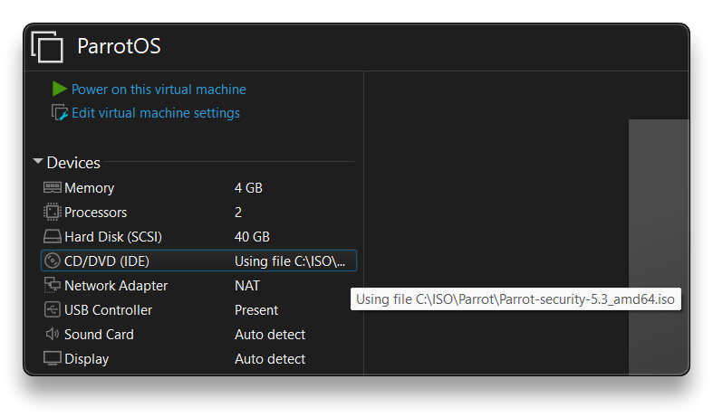
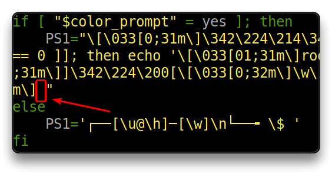
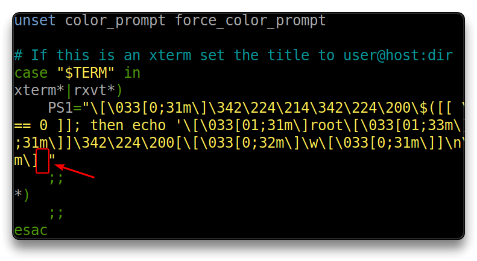
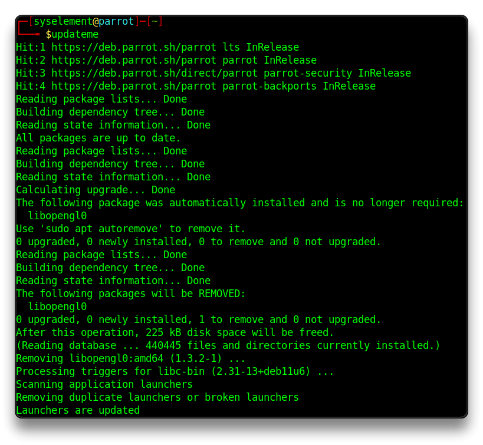
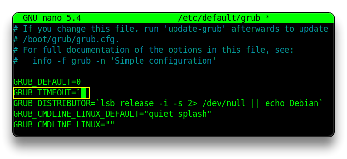
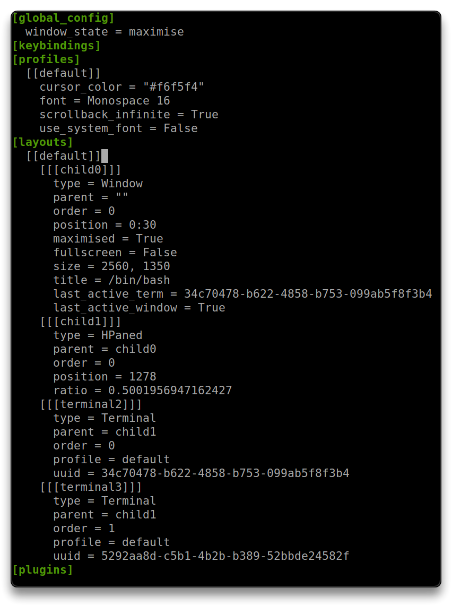

# ParrotOS - VM

 [ParrotOS](https://www.parrotsec.org/)

> 🔗 [Parrot Security Blog - Release Notes](https://parrotsec.org/blog/)

## [First Install - Virtual Machine](https://parrotsec.org/docs/virtualization/parrot-on-vmware)

- Create a new Virtual Machine in VMWare with preferred specs:
  - **Processors**: `1 CPU - 2 Cores`
  - **RAM** Memory: `4 GB`
  - **Hard Disk**: `40 GB`
  - **CD**: use the Parrot Installer .iso image file - [Download here](https://parrotsec.org/download/) - and check *Connect at power on*
  - **Network**: set it as `NAT`
  - Edit virtual machine and ***Remove***: `Printer`
- Boot the virtual machine and proceed with the [ParrotOS Installation](https://parrotsec.org/docs/installation/)




## First Boot & Update

- Disable **CD** *Connect at power on*
- Boot ParrotOS
- Open the Terminal and run the command

```bash
sudo parrot-upgrade
# or
sudo apt update && sudo apt full-upgrade
```

- Reboot the system

```bash
reboot
```


### bash alias - Update packages

```bash
cp /root/.bashrc ~
nano ~/.bashrc
```

- Append the following text with the necessary commands to update all packages:

```bash
# Upgrade all packages and remove unused packages

alias updateme='sudo -- sh -c "sudo apt update && sudo apt -y upgrade && sudo apt -y autoremove"'
```


- Search for `PS1` and add a space after between `]` and `"` of the `PS1` variable in the following places





- Save and exit.
- Reload the bash configuration:

```bash
source ~/.bashrc
```

- Test the command

```bash
updateme
```



------

## Configurations

### GRUB Timeout

```bash
sudo nano /etc/default/grub
```

- Set the seconds in the GRUB_TIMEOUT value, save and exit the file

```bash
GRUB_TIMEOUT=1
sudo update-grub
reboot
```



### New SSH Keys

```bash
sudo /bin/rm -v /etc/ssh/ssh_host_*
sudo dpkg-reconfigure openssh-server
sudo systemctl restart ssh
ssh-keygen -t rsa
```

------

## Tools

### Basic Tools

- Install basic tools

```bash
sudo apt install -y apt-transport-https curl duf flameshot htop neofetch net-tools speedtest-cli telegram-desktop terminator tor tree vlc wget
```

### [Sublime](https://www.sublimetext.com/docs/linux_repositories.html)

```bash
wget -qO - https://download.sublimetext.com/sublimehq-pub.gpg | gpg --dearmor | sudo tee /etc/apt/trusted.gpg.d/sublimehq-archive.gpg > /dev/null

echo "deb https://download.sublimetext.com/ apt/stable/" | sudo tee /etc/apt/sources.list.d/sublime-text.list

sudo apt update && sudo apt install -y sublime-text
```

- Run it with **`subl`** command.

### [Brave](https://brave.com/linux/)

```bash
sudo apt install -y curl

sudo curl -fsSLo /usr/share/keyrings/brave-browser-archive-keyring.gpg https://brave-browser-apt-release.s3.brave.com/brave-browser-archive-keyring.gpg

echo "deb [signed-by=/usr/share/keyrings/brave-browser-archive-keyring.gpg arch=amd64] https://brave-browser-apt-release.s3.brave.com/ stable main"| sudo tee /etc/apt/sources.list.d/brave-browser-release.list

sudo apt update && sudo apt install -y brave-browser
```

### [Github Desktop](https://github.com/shiftkey/desktop)

```bash
wget -qO - https://apt.packages.shiftkey.dev/gpg.key | gpg --dearmor | sudo tee /usr/share/keyrings/shiftkey-packages.gpg > /dev/null

sudo sh -c 'echo "deb [arch=amd64 signed-by=/usr/share/keyrings/shiftkey-packages.gpg] https://apt.packages.shiftkey.dev/ubuntu/ any main" > /etc/apt/sources.list.d/shiftkey-packages.list'

sudo apt update && sudo apt install -y github-desktop
```

### [Terminator](https://gnome-terminator.org/)

```bash
sudo apt install -y terminator
```

- From the `System / Preferences / Personal / Preferred Applications` menu, set `terminator` as the default terminal to use


```bash
sudo update-alternatives --config x-terminal-emulator
```


- Set up your layout. Full screen the Terminator window and split it in half using `CTRL+SHIFT+E` keyboard shortcut.
  - [Terminator Shortcuts here](../tools/Terminator-Shortcuts.md)

- Go to `Preferences - Global` and set **Window state** to `Maximized`
- Go to `Preferences - Profiles - General` and set the **Font** to `Monotspace Regular 16`.
- Go to `Preferences - Profiles - Background` and set the **Background** transparency as you like.
- Go to `Preferences - Profiles - Scrolling` and set the checkmark on **Infinite Scrollback**.
- Go to `Preferences - Layouts` and click on `Add` button to create a new layout and give it a name.
- This should create the `~/.config/terminator/config` file.
- Now you can start `terminator` using the saved layout using: 

```bash
terminator -l <yourLayout>
```

- Edit the `~/.config/terminator/config` file, rename *yourLayout* to `default` and remove/rename the previous default layout. Now, when Terminator starts without any parameters, it will load your custom [[default]] layout!
  - Edit the [[[terminalx]]]/ `command = neofetch;zsh` for the desired terminal, so that it will run your custom command during startup!!

```bash
nano ~/.config/terminator/config
```



- **`ALT+T`** is a keyboard shortcut already configured in ParrotOS. It should open the `terminator` with your configured layout.

### [VS Codium](https://github.com/VSCodium/vscodium)

- ❗ Already present in ParrotOS, if not, follow the commands below

```bash
sudo wget -q https://gitlab.com/paulcarroty/vscodium-deb-rpm-repo/raw/master/pub.gpg && sudo mv pub.gpg /usr/share/keyrings/vscodium-archive-keyring.asc

sudo sh -c 'echo "deb [ signed-by=/usr/share/keyrings/vscodium-archive-keyring.asc ] https://paulcarroty.gitlab.io/vscodium-deb-rpm-repo/debs vscodium main" > /etc/apt/sources.list.d/vscodium.list'

sudo apt update && sudo apt install -y codium codium-insiders
```

### [Docker](https://docs.docker.com/engine/install/debian/)

🔗 [Parrot OS Weird Docker Installation Issues](https://flarexes.com/parrot-os-weird-docker-installation-issues)

```bash
sudo apt update && sudo apt install -y curl apt-transport-https software-properties-common ca-certificates gnupg

for pkg in docker.io docker-doc docker-compose podman-docker containerd runc; do sudo apt remove $pkg -y; done

curl -fsSL https://download.docker.com/linux/debian/gpg | sudo gpg --dearmor -o /usr/share/keyrings/docker.gpg
sudo chmod a+r /usr/share/keyrings/docker.gpg

sudo sh -c 'echo "deb [arch="$(dpkg --print-architecture)" signed-by=/usr/share/keyrings/docker.gpg] https://download.docker.com/linux/debian bullseye stable" | sudo tee /etc/apt/sources.list.d/docker.list'
  
sudo apt update && sudo apt install -y docker-ce docker-ce-cli containerd.io docker-buildx-plugin docker-compose-plugin

sudo systemctl enable docker --now
sudo gpasswd -a "${USER}" docker

# Test
docker run hello-world
```

------

## Offensive Sec Tools

### [Katana](https://github.com/projectdiscovery/katana)

```bash
sudo apt install -y golang

go install github.com/projectdiscovery/katana/cmd/katana@latest

sudo cp ~/go/bin/katana /bin/
```

